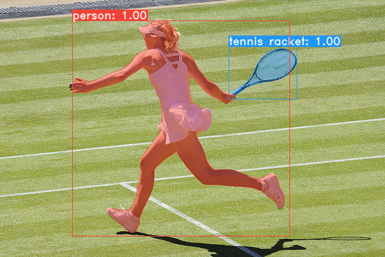
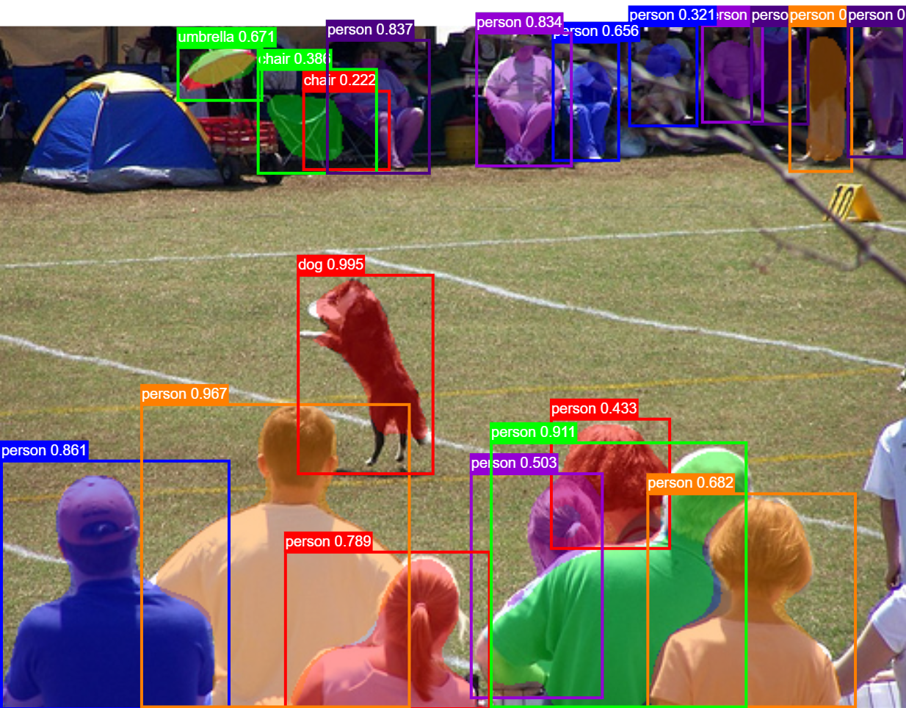

# You Only Look (a couple times)
```
    ██╗   ██╗ ██████╗ ██╗      █████╗  ██████╗████████╗
    ╚██╗ ██╔╝██╔═══██╗██║     ██╔══██╗██╔════╝╚══██╔══╝
     ╚████╔╝ ██║   ██║██║     ███████║██║        ██║   
      ╚██╔╝  ██║   ██║██║     ██╔══██║██║        ██║   
       ██║   ╚██████╔╝███████╗██║  ██║╚██████╗   ██║   
       ╚═╝    ╚═════╝ ╚══════╝╚═╝  ╚═╝ ╚═════╝   ╚═╝ 
```

A model for realtime instance segmentation. Yolact is still in development, so all of this is still subject to change.
Here's a look at our current results (20fps on a Titan Xp):






Because the acronym YOLACT doesn't fit our method anymore, the current name for our model is "Single Shot Segmenter". This, however, is also subject to change.


# Installation
 - Set up a Python3 environment.
 - Install [Pytorch](http://pytorch.org/) 1.0.0 and TorchVision.
 - Install some other packages:
   ```Shell
   # Cython needs to be installed before pycocotools
   pip3 install cython
   pip3 install opencv-python pillow pycocotools matplotlib 
   ```
 - Clone this repository and enter it:
   ```Shell
   git clone https://github.com/dbolya/yolact.git
   cd yolact
   ```
 - Download the COCO dataset and the 2014/2017 annotations. Note that this script will take a while and dump 21gb of files into `./data/coco`.
   ```Shell
   sh data/scripts/COCO.sh
   ```


# Training
 - To train, grab a pretrained VGG16 or Resnet101 model and put it in `./weights`.
   * For VGG16, download `vgg16_reducedfc.pth` from [here](https://github.com/amdegroot/ssd.pytorch).
   * For Resnet101, download `resnet101_reducedfc.pth` from [here](http://vision5.idav.ucdavis.edu:6337/resnet101_reducedfc.pth).
   * For Resnet101 with Group Norm, download `R-101-GN.pkl` from [here](https://s3-us-west-2.amazonaws.com/detectron/ImageNetPretrained/47592356/R-101-GN.pkl).
 - Run one of the training commands below.
   * Note that you can press ctrl+c while training and it will save an `*_interrupt.pth` file at the current iteration.
   * All weights are saved in the `./weights` directory by default with the file name `<config>_<epoch>_<iter>.pth`.
```Shell
# Trains using the default config (whatever it is at the moment) and with batch size 32 (not advisable!)
python3 train.py

# Trains yrm10_config with a batch_size of 5 (suprise). For the 550px models, 1 batch takes up around 1.8 gigs of VRAM, so specify accordingly.
python3 train.py --config=yrm10_config --batch_size=5

# See data/config.py for a list of configs (they end with _config)
# Note that the --config paramater is eval'd so you can do clever stuff like
python3 train.py --config="yolact_resnet101_config.copy({'max_size': 600})" --batch_size=5

# Resume training config yrm10 with a specific weight file and start from the iteration specified in the weight file's name.
python3 train.py --config=yrm10_config --resume=weights/yrm10_10_32100.pth --start_iter=-1

# Use the help option to see a description of all available command line arguments
python3 train.py --help
```


# Evaluation
```Shell
# Quantitatively evaluate a trained model on the entire validation set
# Note: the config will be parsed from the model name. If you don't want that, specify a config with --config
python3 eval.py --trained_model=weights/yrm10_10_32100.pth

# Restrict the number of images evaluated to 100 (since the full validation set will take a while)
python3 eval.py --trained_model=weights/yrm10_10_32100.pth --max_images=100

# Output a COCOEval json to submit to the website or to use the run_coco_eval.py script
python3 eval.py --trained_model=weights/yrm10_10_32100.pth --output_coco_json

# Display qualitative results
python3 eval.py --trained_model=weights/yrm10_10_32100.pth --display

# See the help option for more details (there are a lot of extra command line arguments)
python3 eval.py --help
```
