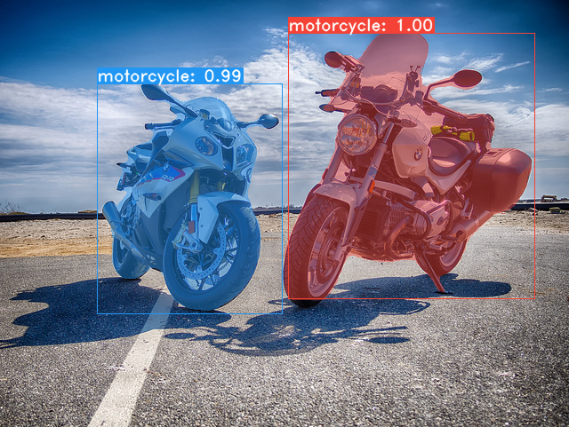

# **Y**ou **O**nly **L**ook **A**t **C**oefficien**T**s
```
    ██╗   ██╗ ██████╗ ██╗      █████╗  ██████╗████████╗
    ╚██╗ ██╔╝██╔═══██╗██║     ██╔══██╗██╔════╝╚══██╔══╝
     ╚████╔╝ ██║   ██║██║     ███████║██║        ██║   
      ╚██╔╝  ██║   ██║██║     ██╔══██║██║        ██║   
       ██║   ╚██████╔╝███████╗██║  ██║╚██████╗   ██║   
       ╚═╝    ╚═════╝ ╚══════╝╚═╝  ╚═╝ ╚═════╝   ╚═╝ 
```

A simple, fully convolutional model for real-time instance segmentation. This is the code for [our paper](https://arxiv.org/abs/1904.02689).

#### YOLACT++ implementation and models released!
YOLACT++ resnet50 model runs at 33.5 fps on a Titan Xp and achieves 34.1 mAP on COCO's `test-dev`.

Related paper will be posted on arXiv soon.

In order to use YOLACT++, make sure you compile the DCNv2 code. (See [Installation](https://github.com/dbolya/yolact#installation))

#### ICCV update (v1.1) released! Check out the ICCV trailer here:
[](https://www.youtube.com/watch?v=0pMfmo8qfpQ)

Read [the changelog](CHANGELOG.md) for details on, well, what changed. Oh, and the paper got updated too with pascal results and an appendix with box mAP.

Some examples from our base model (33.5 fps on a Titan Xp and 29.8 mAP on COCO's `test-dev`):




# Installation
 - Set up a Python3 environment.
 - Install [Pytorch](http://pytorch.org/) 1.0.1 (or higher) and TorchVision.
 - Install some other packages:
   ```Shell
   # Cython needs to be installed before pycocotools
   pip install cython
   pip install opencv-python pillow pycocotools matplotlib 
   ```
 - Clone this repository and enter it:
   ```Shell
   git clone https://github.com/dbolya/yolact.git
   cd yolact
   ```
 - Compile deformable convolutional layers (from [DCNv2](https://github.com/CharlesShang/DCNv2/tree/pytorch_1.0))
   ```Shell
   cd external/DCNv2
   ./make.sh
   ```
 - If you'd like to train YOLACT, download the COCO dataset and the 2014/2017 annotations. Note that this script will take a while and dump 21gb of files into `./data/coco`.
   ```Shell
   sh data/scripts/COCO.sh
   ```
 - If you'd like to evaluate YOLACT on `test-dev`, download `test-dev` with this script.
   ```Shell
   sh data/scripts/COCO_test.sh
   ```


# Evaluation
As of April 5th, 2019 here are our latest models along with their FPS on a Titan Xp and mAP on `test-dev`:

| Image Size | Backbone      | FPS  | mAP  | Weights                                                                                                              |  |
|:----------:|:-------------:|:----:|:----:|----------------------------------------------------------------------------------------------------------------------|--------|
| 550        | Resnet50-FPN  | 42.5 | 28.2 | [yolact_resnet50_54_800000.pth](https://drive.google.com/file/d/1yp7ZbbDwvMiFJEq4ptVKTYTI2VeRDXl0/view?usp=sharing)  | [Mirror](https://ucdavis365-my.sharepoint.com/:u:/g/personal/yongjaelee_ucdavis_edu/EUVpxoSXaqNIlssoLKOEoCcB1m0RpzGq_Khp5n1VX3zcUw) |
| 550        | Darknet53-FPN | 40.0 | 28.7 | [yolact_darknet53_54_800000.pth](https://drive.google.com/file/d/1dukLrTzZQEuhzitGkHaGjphlmRJOjVnP/view?usp=sharing) | [Mirror](https://ucdavis365-my.sharepoint.com/:u:/g/personal/yongjaelee_ucdavis_edu/ERrao26c8llJn25dIyZPhwMBxUp2GdZTKIMUQA3t0djHLw)
| 550        | Resnet101-FPN | 33.0 | 29.8 | [yolact_base_54_800000.pth](https://drive.google.com/file/d/1UYy3dMapbH1BnmtZU4WH1zbYgOzzHHf_/view?usp=sharing)      | [Mirror](https://ucdavis365-my.sharepoint.com/:u:/g/personal/yongjaelee_ucdavis_edu/EYRWxBEoKU9DiblrWx2M89MBGFkVVB_drlRd_v5sdT3Hgg)
| 700        | Resnet101-FPN | 23.6 | 31.2 | [yolact_im700_54_800000.pth](https://drive.google.com/file/d/1lE4Lz5p25teiXV-6HdTiOJSnS7u7GBzg/view?usp=sharing)     | [Mirror](https://ucdavis365-my.sharepoint.com/:u:/g/personal/yongjaelee_ucdavis_edu/Eagg5RSc5hFEhp7sPtvLNyoBjhlf2feog7t8OQzHKKphjw)

YOLACT++ models (released on Dec. 6th, 2019):

| Image Size | Backbone      | FPS  | mAP  | Weights                                                                                                              |  |
|:----------:|:-------------:|:----:|:----:|----------------------------------------------------------------------------------------------------------------------|--------|
| 550        | Resnet50-FPN  | 33.5 | 34.1 | [yolact_plus_resnet50_54_800000.pth](https://drive.google.com/file/d/1ZPu1YR2UzGHQD0o1rEqy-j5bmEm3lbyP/view?usp=sharing)  | [Mirror](https://ucdavis365-my.sharepoint.com/:u:/g/personal/yongjaelee_ucdavis_edu/EcJAtMiEFlhAnVsDf00yWRIBUC4m8iE9NEEiV05XwtEoGw) |
| 550        | Resnet101-FPN | 27.3 | 34.6 | [yolact_plus_base_54_800000.pth](https://drive.google.com/file/d/15id0Qq5eqRbkD-N3ZjDZXdCvRyIaHpFB/view?usp=sharing) | [Mirror](https://ucdavis365-my.sharepoint.com/:u:/g/personal/yongjaelee_ucdavis_edu/EVQ62sF0SrJPrl_68onyHF8BpG7c05A8PavV4a849sZgEA)

To evalute the model, put the corresponding weights file in the `./weights` directory and run one of the following commands.
## Quantitative Results on COCO
```Shell
# Quantitatively evaluate a trained model on the entire validation set. Make sure you have COCO downloaded as above.
# This should get 29.92 validation mask mAP last time I checked.
python eval.py --trained_model=weights/yolact_base_54_800000.pth

# Output a COCOEval json to submit to the website or to use the run_coco_eval.py script.
# This command will create './results/bbox_detections.json' and './results/mask_detections.json' for detection and instance segmentation respectively.
python eval.py --trained_model=weights/yolact_base_54_800000.pth --output_coco_json

# You can run COCOEval on the files created in the previous command. The performance should match my implementation in eval.py.
python run_coco_eval.py

# To output a coco json file for test-dev, make sure you have test-dev downloaded from above and go
python eval.py --trained_model=weights/yolact_base_54_800000.pth --output_coco_json --dataset=coco2017_testdev_dataset
```
## Qualitative Results on COCO
```Shell
# Display qualitative results on COCO. From here on I'll use a confidence threshold of 0.15.
python eval.py --trained_model=weights/yolact_base_54_800000.pth --score_threshold=0.15 --top_k=15 --display
```
## Benchmarking on COCO
```Shell
# Run just the raw model on the first 1k images of the validation set
python eval.py --trained_model=weights/yolact_base_54_800000.pth --benchmark --max_images=1000
```
## Images
```Shell
# Display qualitative results on the specified image.
python eval.py --trained_model=weights/yolact_base_54_800000.pth --score_threshold=0.15 --top_k=15 --image=my_image.png

# Process an image and save it to another file.
python eval.py --trained_model=weights/yolact_base_54_800000.pth --score_threshold=0.15 --top_k=15 --image=input_image.png:output_image.png

# Process a whole folder of images.
python eval.py --trained_model=weights/yolact_base_54_800000.pth --score_threshold=0.15 --top_k=15 --images=path/to/input/folder:path/to/output/folder
```
## Video
```Shell
# Display a video in real-time. "--video_multiframe" will process that many frames at once for improved performance.
# If you want, use "--display_fps" to draw the FPS directly on the frame.
python eval.py --trained_model=weights/yolact_base_54_800000.pth --score_threshold=0.15 --top_k=15 --video_multiframe=4 --video=my_video.mp4

# Display a webcam feed in real-time. If you have multiple webcams pass the index of the webcam you want instead of 0.
python eval.py --trained_model=weights/yolact_base_54_800000.pth --score_threshold=0.15 --top_k=15 --video_multiframe=4 --video=0

# Process a video and save it to another file. This uses the same pipeline as the ones above now, so it's fast!
python eval.py --trained_model=weights/yolact_base_54_800000.pth --score_threshold=0.15 --top_k=15 --video_multiframe=4 --video=input_video.mp4:output_video.mp4
```
As you can tell, `eval.py` can do a ton of stuff. Run the `--help` command to see everything it can do.
```Shell
python eval.py --help
```


# Training
By default, we train on COCO. Make sure to download the entire dataset using the commands above.
 - To train, grab an imagenet-pretrained model and put it in `./weights`.
   - For Resnet101, download `resnet101_reducedfc.pth` from [here](https://drive.google.com/file/d/1tvqFPd4bJtakOlmn-uIA492g2qurRChj/view?usp=sharing).
   - For Resnet50, download `resnet50-19c8e357.pth` from [here](https://drive.google.com/file/d/1Jy3yCdbatgXa5YYIdTCRrSV0S9V5g1rn/view?usp=sharing).
   - For Darknet53, download `darknet53.pth` from [here](https://drive.google.com/file/d/17Y431j4sagFpSReuPNoFcj9h7azDTZFf/view?usp=sharing).
 - Run one of the training commands below.
   - Note that you can press ctrl+c while training and it will save an `*_interrupt.pth` file at the current iteration.
   - All weights are saved in the `./weights` directory by default with the file name `<config>_<epoch>_<iter>.pth`.
```Shell
# Trains using the base config with a batch size of 8 (the default).
python train.py --config=yolact_base_config

# Trains yolact_base_config with a batch_size of 5. For the 550px models, 1 batch takes up around 1.5 gigs of VRAM, so specify accordingly.
python train.py --config=yolact_base_config --batch_size=5

# Resume training yolact_base with a specific weight file and start from the iteration specified in the weight file's name.
python train.py --config=yolact_base_config --resume=weights/yolact_base_10_32100.pth --start_iter=-1

# Use the help option to see a description of all available command line arguments
python train.py --help
```

## Multi-GPU Support
YOLACT now supports multiple GPUs seamlessly during training:

 - Before running any of the scripts, run: `export CUDA_VISIBLE_DEVICES=[gpus]`
   - Where you should replace [gpus] with a comma separated list of the index of each GPU you want to use (e.g., 0,1,2,3).
   - You should still do this if only using 1 GPU.
   - You can check the indices of your GPUs with `nvidia-smi`.
 - Then, simply set the batch size to `8*num_gpus` with the training commands above. The training script will automatically scale the hyperparameters to the right values.
   - If you have memory to spare you can increase the batch size further, but keep it a multiple of the number of GPUs you're using.
   - If you want to allocate the images per GPU specific for different GPUs, you can use `--batch_alloc=[alloc]` where [alloc] is a comma seprated list containing the number of images on each GPU. This must sum to `batch_size`.

## Logging
YOLACT now logs training and validation information by default. You can disable this with `--no_log`. A guide on how to visualize these logs is coming soon, but now you can look at `LogVizualizer` in `utils/logger.py` for help.

## Pascal SBD
We also include a config for training on Pascal SBD annotations (for rapid experimentation or comparing with other methods). To train on Pascal SBD, proceed with the following steps:
 1. Download the dataset from [here](http://home.bharathh.info/pubs/codes/SBD/download.html). It's the first link in the top "Overview" section (and the file is called `benchmark.tgz`).
 2. Extract the dataset somewhere. In the dataset there should be a folder called `dataset/img`. Create the directory `./data/sbd` (where `.` is YOLACT's root) and copy `dataset/img` to `./data/sbd/img`.
 4. Download the COCO-style annotations from [here](https://drive.google.com/open?id=1ExrRSPVctHW8Nxrn0SofU1lVhK5Wn0_S).
 5. Extract the annotations into `./data/sbd/`.
 6. Now you can train using `--config=yolact_resnet50_pascal_config`. Check that config to see how to extend it to other models.

I will automate this all with a script soon, don't worry. Also, if you want the script I used to convert the annotations, I put it in `./scripts/convert_sbd.py`, but you'll have to check how it works to be able to use it because I don't actually remember at this point.

If you want to verify our results, you can download our `yolact_resnet50_pascal_config` weights from [here](https://drive.google.com/open?id=1yLVwtkRtNxyl0kxeMCtPXJsXFFyc_FHe). This model should get 72.3 mask AP_50 and 56.2 mask AP_70. Note that the "all" AP isn't the same as the "vol" AP reported in others papers for pascal (they use an averages of the thresholds from `0.1 - 0.9` in increments of `0.1` instead of what COCO uses).

## Custom Datasets
You can also train on your own dataset by following these steps:
 - Create a COCO-style Object Detection JSON annotation file for your dataset. The specification for this can be found [here](http://cocodataset.org/#format-data). Note that we don't use some fields, so the following may be omitted:
   - `info`
   - `liscense`
   - Under `image`: `license, flickr_url, coco_url, date_captured`
   - `categories` (we use our own format for categories, see below)
 - Create a definition for your dataset under `dataset_base` in `data/config.py` (see the comments in `dataset_base` for an explanation of each field):
```Python
my_custom_dataset = dataset_base.copy({
    'name': 'My Dataset',

    'train_images': 'path_to_training_images',
    'train_info':   'path_to_training_annotation',

    'valid_images': 'path_to_validation_images',
    'valid_info':   'path_to_validation_annotation',

    'has_gt': True,
    'class_names': ('my_class_id_1', 'my_class_id_2', 'my_class_id_3', ...)
})
```
 - A couple things to note:
   - Class IDs in the annotation file should start at 1 and increase sequentially on the order of `class_names`. If this isn't the case for your annotation file (like in COCO), see the field `label_map` in `dataset_base`.
   - If you do not want to create a validation split, use the same image path and annotations file for validation. By default (see `python train.py --help`), `train.py` will output validation mAP for the first 5000 images in the dataset every 2 epochs.
 - Finally, in `yolact_base_config` in the same file, change the value for `'dataset'` to `'my_custom_dataset'` or whatever you named the config object above. Then you can use any of the training commands in the previous section.

#### Creating a Custom Dataset from Scratch
See [this nice post by @Amit12690](https://github.com/dbolya/yolact/issues/70#issuecomment-504283008) for tips on how to annotate a custom dataset and prepare it for use with YOLACT.


# Citation
If you use YOLACT or this code base in your work, please cite
```
@inproceedings{bolya-iccv2019,
  author    = {Daniel Bolya and Chong Zhou and Fanyi Xiao and Yong Jae Lee},
  title     = {YOLACT: {Real-time} Instance Segmentation},
  booktitle = {ICCV},
  year      = {2019},
}
```


# Contact
For questions about our paper or code, please contact [Daniel Bolya](mailto:dbolya@ucdavis.edu).
